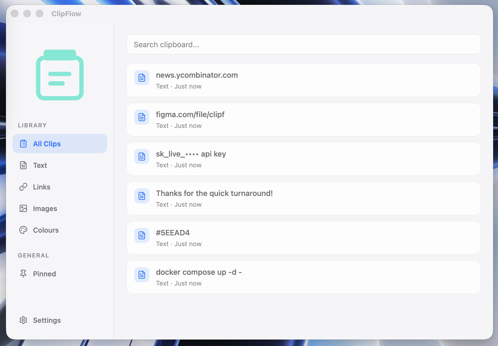

# ClipFlow

  

  <strong>A lightweight, local-first clipboard manager built with Tauri.</strong>

  Store, search, and instantly reuse everything you copy.

  

---

## ✨ Features

### 📋 Clipboard History
ClipFlow automatically remembers everything you copy, including:

- 📝 Plain text
- 🔗 Links
- 🖼️ Images (Experimental)

Everything is stored locally on your device.

---

### 🔍 Instant Search

Quickly find previous clipboard items using the built-in search.

No cloud.
No indexing delays.

---

### 📌 Pin Important Items

Keep frequently used snippets at the top of your clipboard history.

Perfect for:

- API keys
- Email addresses
- Templates
- Commands
- Frequently used text

---

### 🎨 Modern Interface

- Light Theme
- Dark Theme
- System Theme
- Apple-inspired interface
- Fast and lightweight

---

### ⚙️ Settings

- Enable/disable clipboard monitoring
- Change theme
- Configure clipboard history size
- Clear clipboard history

---

## 🚀 Downloads

The latest version is available from the GitHub Releases page.

**Current Release**

- ClipFlow 0.1.0 Beta (Apple Silicon)

> Intel Mac, Windows and Linux builds are planned.

---

## 🖥️ Built With

- Tauri 2
- React
- TypeScript
- SQLite
- Lucide Icons

---

## 📷 Screenshots

---

## 🗺️ Roadmap

### Current

- ✅ Clipboard history
- ✅ Search
- ✅ Pinning
- ✅ SQLite storage
- ✅ Themes
- ✅ Image previews (experimental)

### Planned

- Global keyboard shortcuts
- Rich link previews
- Color detection
- File clipboard support
- Menu bar mode
- Drag & Drop
- Collections
- Cloud Sync (optional)
- OCR
- Image history improvements

---

## 🐞 Beta

ClipFlow is currently in **Beta**.

Known limitations include:

- Image support is experimental.
- Large images are currently ignored to improve performance.
- Image history persistence is still being improved.
- Some planned keyboard shortcuts are not yet available.

If you encounter a bug or have a feature request, please open an Issue.

---

## 🤝 Contributing

Contributions, ideas, bug reports and feature requests are welcome.

If you'd like to contribute, please fork the repository and submit a Pull Request.

---

## 📄 License

This project is licensed under the MIT License.

---

Made with ❤️ using Tauri and React.

